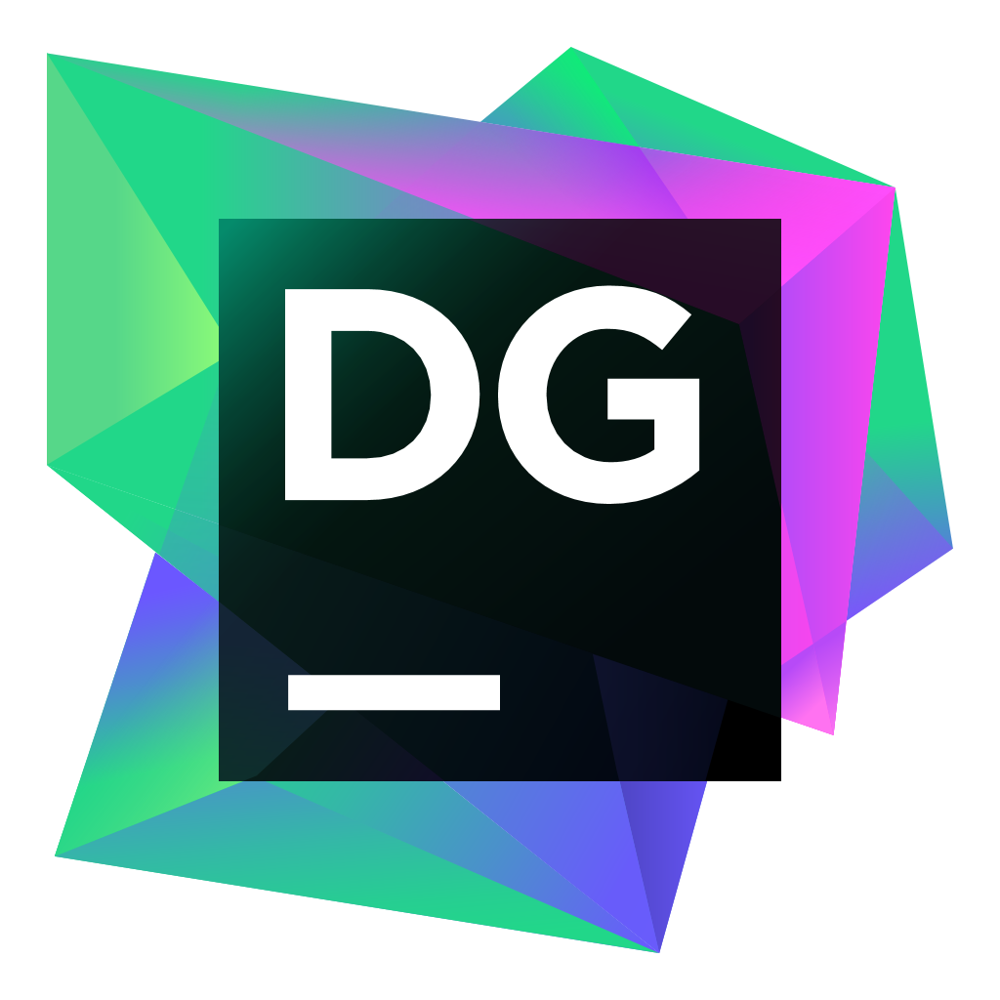
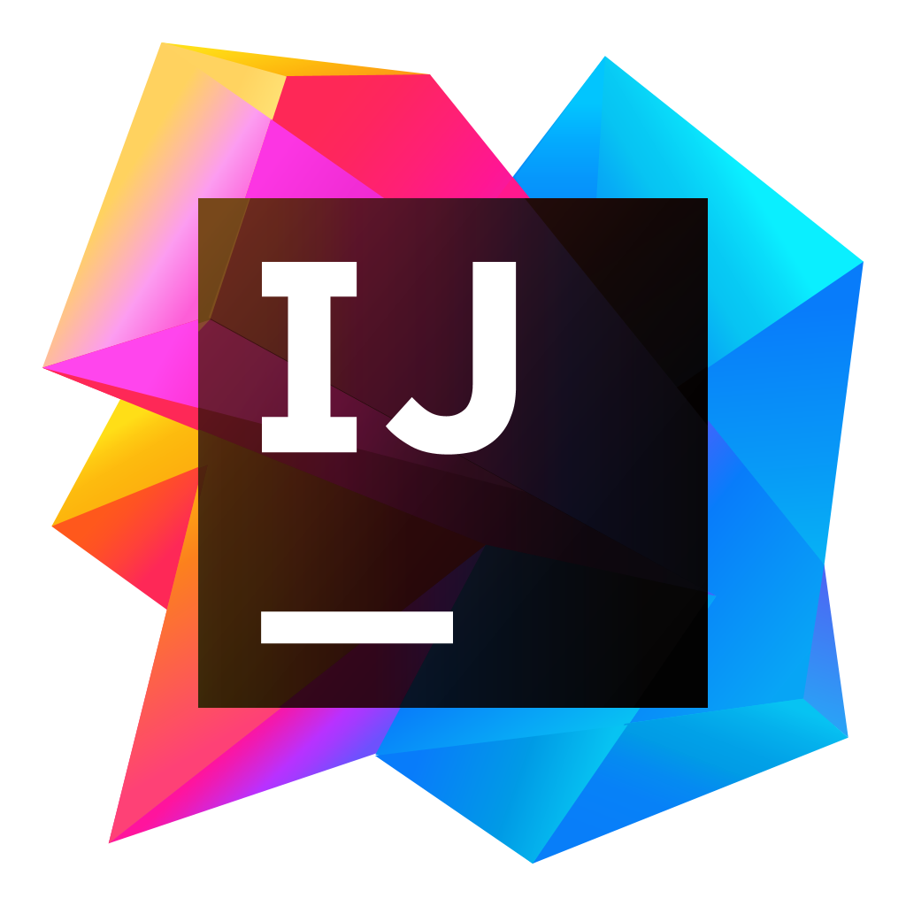
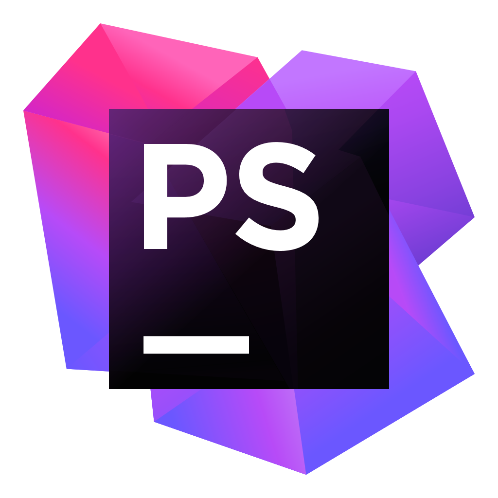
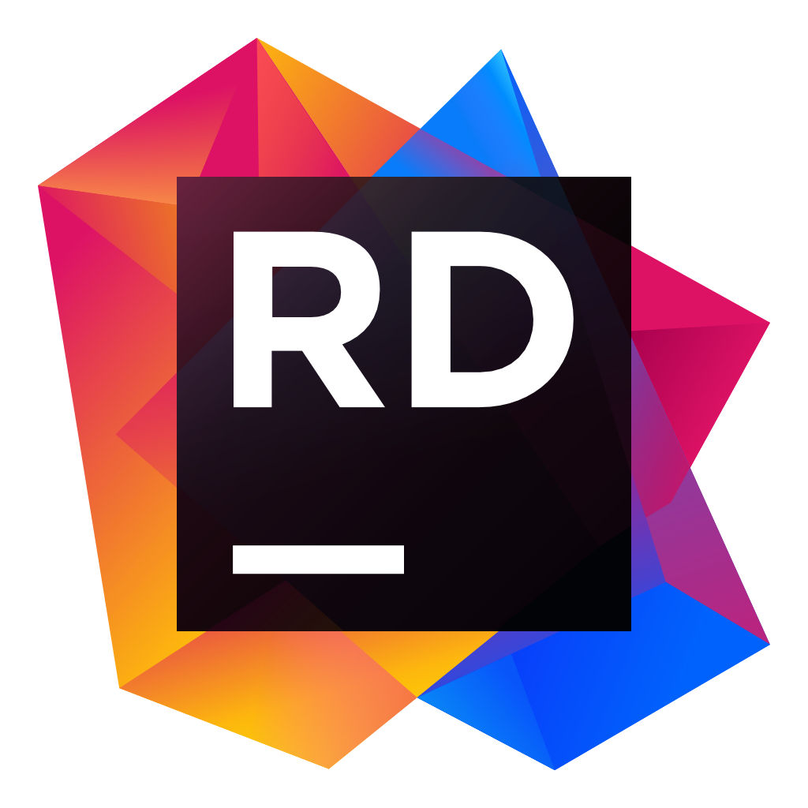
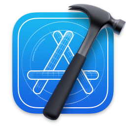

<h1 align="center">Hi 👋, I'm Yohann BREUIL</h1>
<h3 align="center">Web developper at SOeMAN Group</h3>

- 💻 I'm interested in **web and mobile technologies**

- 🔭 I’m currently working on **SOeMAN Group**

- 🌱 I’m currently learning **mobile development**

- 📫 How to reach me **breuil.yohann@orange.fr**

---

## OS

	
	
	
	

## IDE

	
	
	
	
	
	

## Languages

## Frameworks & Libraries

## Stats

